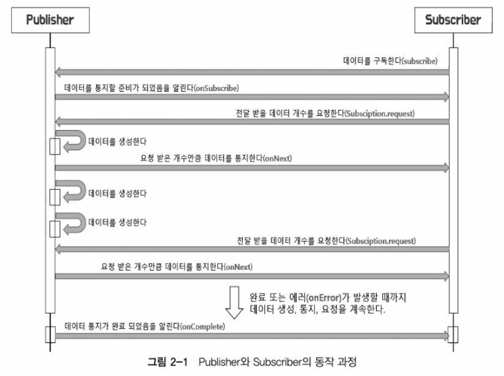

# Reactive Streams
- what is reactive streams?
  - 데이터 스트림을 Non-Blocking 이면서 비동기적인 방식으로 처리하기 위한 리액티브 라이브러리의 표준 사양
  - 구현체
    - RxJava
    - Reactor -> Spring WebFlux
    - Akka Streams
    - Java 9 Flow API
- Compose of Reactive Streams
  - Publisher
    - 데이터를 발행하는 Producer
    - Publisher는 Subscriber를 구독할 수 있음
  - Subscriber
    - 구독한 Publisher 로부터 데이터를 소비하는 Consumer
    - Subscriber는 Publisher를 구독함
  - Subscription
    - Publisher와 Subscriber 사이의 구독 관계를 나타내는 객체
    - Subscriber는 Subscription을 통해 Publisher에게 데이터를 요청하거나 구독을 취소할 수 있음
  - Processor
    - Publisher와 Subscriber의 역할을 모두 수행하는 객체
    - Publisher와 Subscriber 사이에서 데이터를 가공하거나 변환하는 역할을 함
 

- 

    - Subsciber는 Publisher를 구독하고, Publisher는 Subscriber에게 데이터를 통지(발행, 게시 방출)할 준비가 되었음을 onSubscribe 로 알려줌
    - Subscriber 는 Subscription.request 로 데이터 개수를 Publisher에게 요청함
    - Publisher 는 onNext 로 Subscriber 에게 데이터를 통지함
    - Publisher 는 onComplete 로 데이터 통지가 완료되었음을 Subscriber 에게 알림
      - onError 로 에러가 발생했음을 Subscriber 에게 알림
- kafka Pub/Sub
  - kafka 에서 publisher 는 메세지를 mb 의 topic 에 보내기만
  - subscriber 는 topic 을 구독하고, topic 에서 메세지를 가져오기만
- reactive streams pub/sub
  - 개념상으로는 subscriber 가 구독하는 것이 맞지만 실제 코드상에는 publisher 가 subscribe 메서드의 파라미터인 subscriber 를 등록하는 형태로 구독이 이뤄짐
   - 각주 : 이를테면 Subscription 이 mb 역할인듯 
  - `PubSub.java`
- 리액티브 스트림즈 관련 용어 정의
  - signal
    - Publisher 와 Subscriber 사이에서 주고받는 상호작용
    - onSubscribe, onNext, onComplete, onError, request, cacnel 등의 메서드 호출
  - Demand
    - Publisher 가 Subscriber 에게 전달하지 않은 Subscriber 가 요청한 데이터
  - Emit
    - 통지(발행, 게시, 방출) -> onNext Signal
  - Upstream / Downstream
    - 현재 호출한 메서드에서 반환된 Flux의 위치에서 자신보다 더 상위에 있는 Flux 는 Upstream, 하위에 있는 Flux 는 Downstream
    - Upstream -> origin / Downstream -> derived
  - Sequence
    - Publisher 가 emit 하는 데이터의 연속적인 흐름 정의
    - Sequence 는 Operator chain
    - filtering, mapping, ... etc
  - Operator
    - Publisher 와 Subscriber 사이에서 데이터를 가공하거나 변환하는 역할을 하는 객체
  - Source
    - Original, 최초에 생성된 무언가
- 리액티브 스트림즈의 구현 규칙
  - publisher 구현을 위한 주요 기본 규칙
    1. Publisher 가 Subscriber 에게 보내는 onNext signal 의 총 개수는 항상 해당 Subscriber 의 구독을 통해 요청된 데이터의 총 개수보다 더 작거나 같아야 한다.
       - backpressure
    2. Publisher 는 요청된 것보다 적은 수의 onNext signal 을 보내고 onComplete 또는 onError 를 호출하여 구독을 종료할 수 있다.
    3. Publisher 의 데이터 처리가 실패하면 onError signal 을 보내야 한다.
    4. Publisher 의 데이터 처리가 성공적으로 종료되면 onComplete signal 을 보내야 한다.
    5. Publisher 가 Subscriber 에게 onError 또는 onComplete signal 을 보낸 경우 해당 Subscriber 의 구독은 취소된 것으로 간주되어야 한다.
    6. 일단 종료 상태 signal 을 받으면 (onError, onCommplete) 더 이상 signal 이 발생되지 않아야 한다.
    7. 구독이 취소되면 Subscriber 는 결국 signal 을 받는 것을 중지해야 한다.
  - Subscriber 구현을 위한 주요 기본 규칙
    1. Subscirber 는 Publisher 로부터 onNext signal 을 수신하기 위해 Subscription.request(n) 을 통해 Demand signal 을 Publisher 에게 보내야 한다.
    2. Subscriber.onComplete() 및 Subscriber.onError(t) 는 Subscription 또는 Publisher 의 메서드를 호출해서는 안된다.
    3. Subscriber.onComplete() 및 Subscriber.onError(t)는 signal 을 수신한 후 구독이 취소된 것으로 간주
    4. 구독이 더 이상 필요하지 않은 경우 Subscirber 는 Subscription.cancel() 을 호출해야 한다.
    5. Subscriber.onSubscribe() 는 지정된 Subscriber 에 대해 최대 한 번만 호출되어야 한다.
  - Subscription 구현을 위한 주요 기본 규칙
    1. 구독은 Subscriber 가 onNext 또는 onSubsribe 내에서 동기적으로 Subscription.request 를 호출하도록 허용해야 한다.
    2. 구독이 취소된 후 Subsription.request / cancel 은 효력이 없어야 한다.
    3. 구독이 취소되지 않은 동안 Subscription.request(n < 0) 은 IllegalStateException 을 발생시켜야 한다.
    4. 구독이 취소되지 않은 동안 Subsription.cancel 은 Publisher 가 Subscriber 에게 보내는 signal 을 중지해야 한다.
    5. 구독이 취소되지 않은 동안 Subsription.cancel 은 Publisher 에게 해당 구독자에 대한 참조를 결국 삭제하도록 요청해야 한다.
    6. Subscription.cancel / request 에 대한 응답으로 예외는 안됨
    7. 구독은 무제한 수의 request 호출을 지원해야 하고 최대 2^63 - 1 까지의 demand 를 지원해야 한다.
