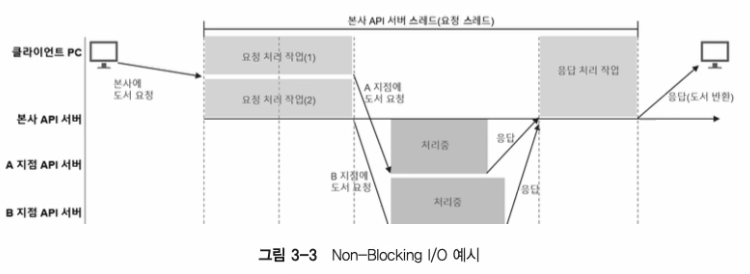

# Blocking IO , Non-Blocking IO
- Blocking IO
  - IO
    - Input / Output
    - 데이터를 읽어 들이거나 쓰는 행위
    - When IO event occurs, the thread is blocked until the IO operation is completed
  - Context Switching
    - CPU 가 프로세스를 번갈아가며 실행하여 여러 프로세스를 동시에 실행하는 것처럼 보이게 하는 것
    - 이 때 PCB(Process Control Block) 라는 자료구조를 통해 프로세스의 상태를 저장하고 복원함
    - PCB 로부터 불러오는 과정을 컨텍스트 스위칭이라고 함
    - 문제가 되는 것은 프로세스 정보를 PCB 에 저장, reload 하는 시간 동안에 CPU 가 다른 작업을 하지 못하고 대기
      - Context Switching 이 많을 수록 CPU 전체 대기 시간은 길어짐
    - TCB
      - Thread Control Block
      - PCB 와 유사한 역할을 수행
      - Process 내에서 Switching 되는 Thread 의 상태를 저장하고 복원
    - 문제
      - 과다한 메모리 사용으로 오버헤드 발생
        - JVM 에서는 스레드를 실행하면 해당 스레드를 위한 stack 메모리를 할당
        - 새로운 스레드의 정보는 스택 영역에 개별 프레임의 형태로 저장
        - JVM 의 디폴트 스택 사이즈는 64bit -> 1024KB
          - 64,000 명 접속시 64GB 필요
      - Thread Pool 응답 지연이 발생
        - idle thread 가 없을 경우 사용 가능한 스레드 확보까지 응답 지연 발생
- Non-Blocking IO

- worker thread 종료 여부와 관계없이 요청한 스레드는 차단되지 않음
  - 하나의 스레드로 많은 수의 요청을 처리할 수 있음 -> CPU 효율 기대
- 단점
  - 만약 스레드 내부에서 CPU 를 많이 사용하는 작업이 포함된 경우 성능에 악영향
  - 사용자의 요청에서 응답까지의 전체 과정에 Blocking IO 요소가 포함된 경우 Non-Blocking 의 이점이 없어짐
- Sping Framwork 에서의 Blocking IO Non-Blocking IO
  - Spring MVC : Blocking IO
  - Spring WebFlux : Non-Blocking IO
- Non-Blocking IO 방식의 통신에 적합한 시스템
  - 대량의 요청 트래픽이 발생하는 시스템
  - MSA
  - Streaming / real time service
