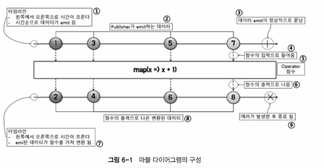
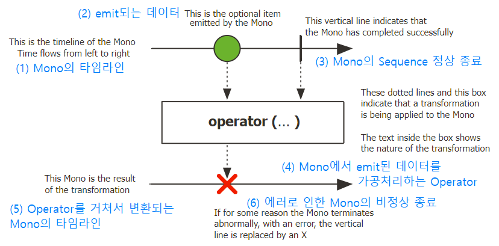
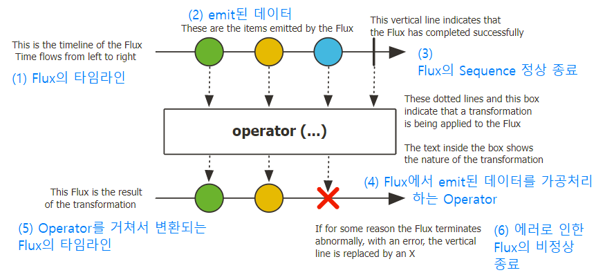

# Marble Diagram
- what is marble diagram?
  - 여러 구슬 모양의 도형으로 구성된 도표

- Marble Diagram 으로 Reactor 의 Publisher 이해하기
  - Mono
    - `/prac/HelloMono.java` 
    - 단 하나의 데이터를 emit 하는 Publisher
    - 
  - Flux
    - `/prac/HelloFlux.java`
    - 여러개의 데이터를 emit 하는 Publisher
    - 
