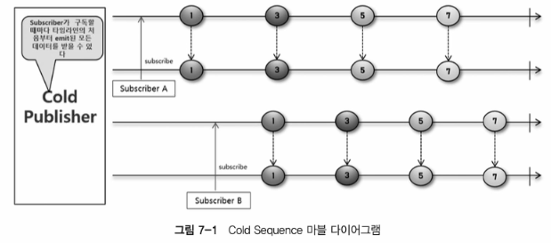
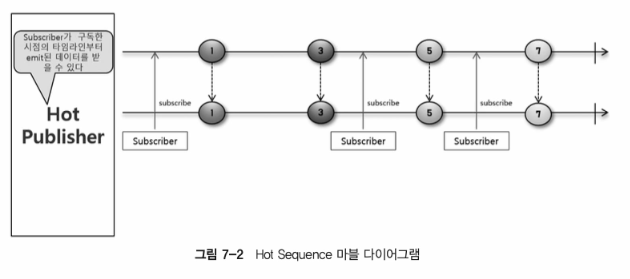

# Cold Sequence / Hot Sequence
- CS 에서의 Hot / Cold
  - Hot : 무언가 다시 시작하지 않고 같은 작업이 반복되지 않는 느낌, 서버나 시스템을 다시 가동할 필요가 없고 인터넷에 다시 연결할 필요 없이 바로 사용 가능
  - Cold : 무언가 다시 시작해야 하는 느낌, 새로 시작하기 때문에 같은 작업이 반복됨
- Cold Sequence
  - `ColdSequece.java` 
  - Subscriber 가 구독할 때마다 데이터 흐름이 처음부터 다시 시작되는 Sequence
  - 
- Hot  Sequence
    - `HotSequence.java`
    - Subscriber 가 구독할 때마다 데이터 흐름이 처음부터 다시 시작되지 않는 Sequence
    - 아래 사진에서 가장 처음 들어온 subscriber 은 1 - 7, 2 번째 subscriber 5 - 7, 3 번째 subscriber 7 만 받음
    - 
- Summary
  - Subscriber 의 구독 시점이 달라도 구독을 할 때마다 Publisher 가 데이터를 처음부터 emit 하는 것을 cold sequence
  - Cold Sequence 흘므으로 동작하는 Publisher 를 Cold Publisher 라고 한다
  - Publihser 가 데이터를 emit 하는 과정이 한 번만 일어나고 Subscriber 가 각각의 구독 시점 이후에 emit 된 데이터만 전달하는 것을 Hot Sequence
  - Hot Sequence 흐름으로 동작하는 Publisher 를 Hot Publisher 라고 한다
  - share(), cache() 등의 Operator 를 사용해서 Cold Sequence 를 Hot Sequence 로 변환할 수 있다
  - Hot Sequence 는 Subscriber 의 최초 구독이 발생해야 Publisher 가 데이터를 emit 하는 warm up, Subscriber 의 구독 여부와 상관 없이 데이터를 emit 하는 hot 유형으로 나눌 수 있다
