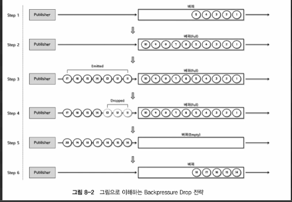
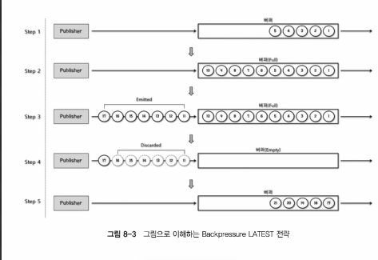
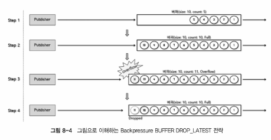
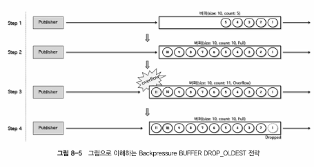

# Backpressure
- what is backpressure?
  - 배압 / 역압
  - 데이터를 받는 쪽에서 데이터를 처리할 수 있는 속도로 데이터를 보내는 것
    - 데이터를 받아 처리하는 Downstream Publisher 또한 consumer(DownStream consumber)
  - Publisher 가 끊임없이 emit 하는 무수히 많은 데이터를 적절하게 제어하여 데이터 처리 과부하가 걸리지 않도록 하는 것
- Reactor 에서의 Backpressure 처리 방식
  - 데이터 개수 제어
    - `HelloBackpressure.java` 참고
  - Backpressure Strategy
    - Reactor 에서 제공하는 Backpressure 전략
      - IGNORE 전략 : Backpressure 를 적용하지 않는다.
      - ERROR 전략 : Downstream 으로 전달할 데이터가 버퍼에 가득 차면 `IllegalStateException` 을 발생시킨다.
        - `ErrorStrategy.java` 참고
      - DROP 전략 : Downstream 으로 전달할 데이터가 버퍼에 가득 차면 대기하는 순서대로 버린다.
        - 
        - `DropStrategy.java` 참고
      - LATEST 전략 : Downstream 으로 전달할 데이터가 버퍼에 가득 차면 가장 최근에 버퍼에 추가된 데이터를 전달한다.
        - 
        - `LatestStrategy.java` 참고
      - BUFFER 전략 : Downstream 으로 전달할 데이터가 버퍼에 가득 차면 버퍼 안에 있는 데이터부터 Drop 시킴
        - DROP_LATEST
          - 버퍼가 가득 찰 경우 가장 최근(나중에) 버퍼 안에 채워진 데이터를 drop 하여 폐기한 후 확보된 공간에 데이터를 채움
          - `DropLatestStrategy.java` 참고
          - 
        - DROP_OLDEST
          - 버퍼가 가득 찰 경우 가장 오래된(먼저) 버퍼 안에 채워진 데이터를 drop 하여 폐기한 후 확보된 공간에 데이터를 채움 
          - `DropOldestStrategy.java` 참고
          - 
    - 각주
      - reactor 에서 사용하는 Buffer (bounded queue) 는 256 개의 데이터를 저장할 수 있다.
      - `-Dreacotr.bufferSize.default=1024` 와 같이 시스템 프로퍼티를 설정하여 기본 버퍼 크기를 변경할 수 있다.
- Summary
  - Backpressure 는 Publisher 가 끊임없이 emit 하는 무수히 많은 데이터를 적절하게 제어하여 처리에 있어 과부하가 걸리지 않도록 제어하는 데이터 처리 방식
  - Reactor 에서 지원하는 Backpressure 처리 방식에는 데이터 요청 개수를 제어하는 방식, Backpressure 전략을 사용하는 방식 등이 있다.
