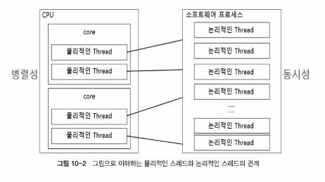
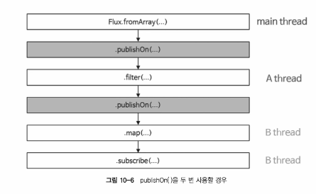
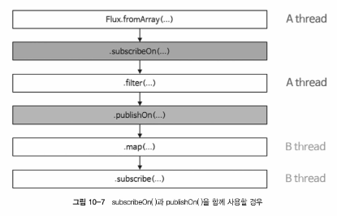

# Scheduler
- Thread 의 개념 이해
  - Physical Thread
    - 물리적인 코어를 논리적으로 나눈 코어를 물리적인 스레드
  - Logical Thread
    - 소프트웨어적으로 생성되는 스레드 (User Thread)
    - 
  - 물리적인 스레드는 병렬성과 관련이 있으며 논리적인 스레드는 동시성과 관련이 있다.
  - 병렬성
    - 물리적인 스레드가 실제로 동시에 실행되는 것
  - 동시성
    - 동시에 실행되는 것처럼 보이는 것
- What is Scheduler
  - 운영체제에서 사용되는 Scheduler 와 의미가 비슷하다
  - Scheduler 는 Reactor Sequence 에서 비동기 프로그래밍을 위해 사용되는 스레드를 관리해주는 관리자
    - Scheduler 를 사용하여 어떤 스레드에서 무엇을 처리할지 제어
- Shceduler 를 위한 전용 Operator
  - `subscribeOn()`
    - 구독이 발생한 직후 실행될 스레드를 지정
    - publisher 의 동작을 수행하기 위한 스레드
  - `publishOn()`
    - Subscriber 가 데이터를 처리할 스레드를 지정
  - `parallel()`
    - parallel() Operator 는 병렬성을 가지는 물리적인 스레드, RR 방식으로 논리적인 코어(물리적인 스레드)를 할당, 4코어 8스레드 CPU 라면 총 8개의 스레드를 병렬로 실행
  - `SchedulerPrac.java` 참고
- publishOn 과 subscribeOn 의 동작 이해
- 

  - `PublishOnPrac.java` 참고

- 

  - `PubOnSubOnPrac.java` 참고

- Scheduler 의 종류
  - immediate
    - 현재 스레드에서 실행
  - single
    - 단일 스레드에서 실행
  - newSingle
    - 새로운 스레드에서 실행
  - boundedElastic
    - 스레드 풀에서 실행 (재사용 가능)
    - CPU 코어 수 * 10개의 스레드 생성
    - 이용가능한 스레드가 생길 때까지 최대 100,000 개의 작업이 큐에서 대기할 수 있음
    - Blocking IO 데이터를 처리하기에 유용
  - parallel
    - CPU 코어 수만큼 스레드 생성
    - Non-Blocking IO 데이터를 처리하기에 유용
  - fromExecutorService
    - ExecutorService 를 이용하여 스레드 생성
    - Reactor 에서는 이 방식을 권장하지 않음
  - newXXXX
    - 새로운 스레드를 생성
    - newSingle, newElastic, newParallel, newBoundedElastic