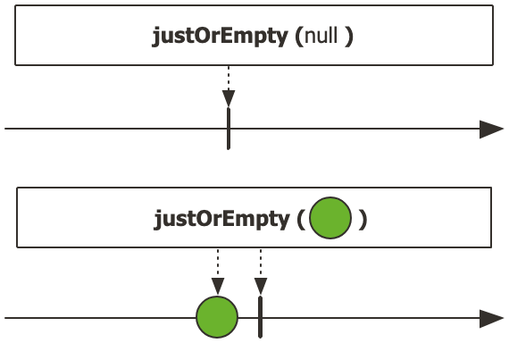
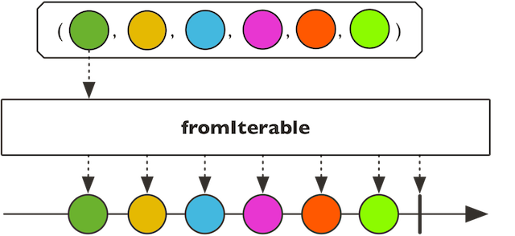
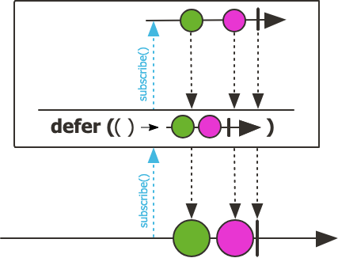
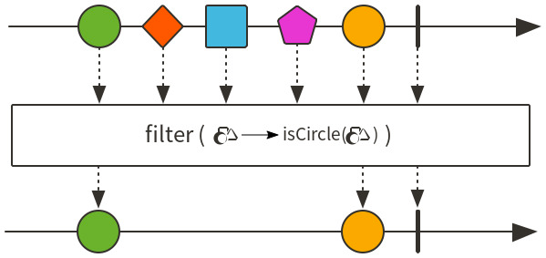
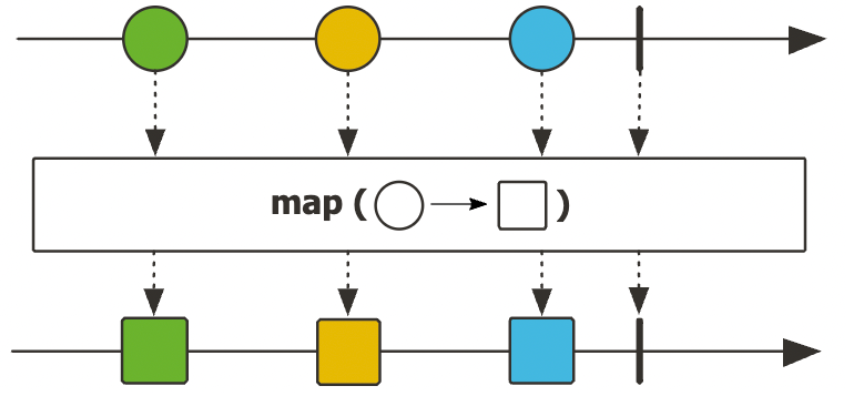
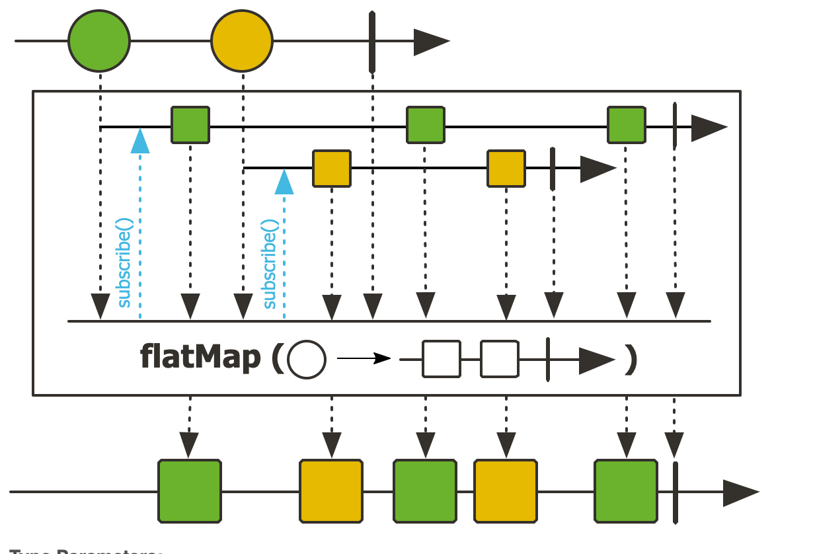
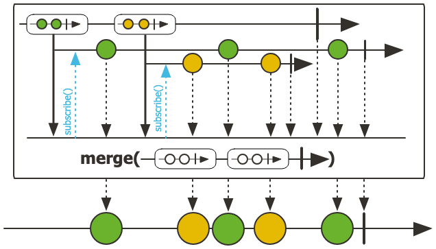
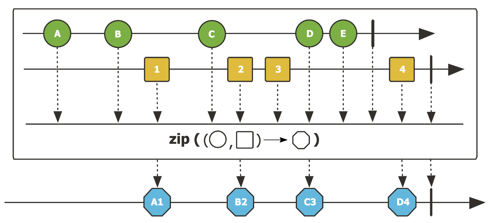

# Operators
- just, create, fromArray, filter, map ...etc

- data or null -> data 가 null 이어도 NPE 발생 하지않고 onComplete() 호출

 
 

- iterable 로 부터 publisher 생성
- fromStream 도 동일한 기능
- range 도 동일한 기능이지만, `range(n, m)` 으로 n 부터 m 까지의 숫자를 emit

 
 

- defer : subscribe() 호출 시점에 생성된다는 점이 가장 큰 차이점, 데이터 emit 을 지연시켜 꼭 필요한 시점에 데이터를 emit 하여 불필요한 프로세스를 줄임
    - `DeferPrac.java` 참고

- using : 파라미터로 전달받은 resource 를 emit 하는 Flux 를 생성
  - `UsingPrac.java` 참고

- generate : 프로그래밍 방식으로 signal 이벤트(동기적)를 발생시키며 파라미터로 전달받은 state 를 이용해서 데이터를 생성하는 Flux 를 생성
  - `GeneratePrac.java` 참고

- create : generate 와 동일한 기능을 제공하지만, create 는 한 번에 데이터를 비동기적으로 emit 할 수 있음 
  - `CreatePrac.java` 참고

 
 

- filter : 파라미터로 전달받은 Predicate 에서 true 를 리턴하는 데이터만 emit 하는 Flux 를 생성
  - `FilterWhenPrac.java` 참고

 
 

- skip : 파라미터로 전달받은 개수만큼 데이터를 skip 하고 나머지 데이터를 emit 하는 Flux 를 생성
- take / takeLast : 파라미터로 전달받은 개수만큼 데이터를 emit 하고 onComplete() 호출
  - takeUntil : 파라미터로 입력한 람다가 true 가 될 때까지 Upstream 에서 emit 된 데이터를 Downstream 으로 emit
    - Predicate 를 평가할 때 사용한 데이터가 Downstream 으로 emit 됨
  - takeWhile : 파라미터로 입력한 람다가 true 를 리턴하는 동안에만 Upstream 에서 emit 된 데이터를 Downstream 으로 emit
    - Predicate 를 평가할 때 사용한 데이터가 Downstream 으로 emit 되지 않음
- next : Upstream 에서 emit 되는 데이터 중에서 첫 번째 데이터만 Downstream 으로 emit
  - Upstream 에서 emit 되는 데이터가 empty 면 Mono.empty() 를 리턴

 
 

- map : mapper function 을 사용하여 변환 후 Downstream 으로 emit

 
 

- flatMap : Upstream 에서 emit 된 데이터가 Inner Seuqence 에서 평탄화 작업을 거치면서 하나의 Sequence 로 병합되어 Downstream 으로 emit

 
 

- concat : 파라미터로 입력되는 Publisher 의 Sequence 를 연결해서 데이터를 순차적으로 emit
  - 먼저 입력된 Publisher 의 Sequence 가 종료될 때까지 나머지 Publisher 의 Sequence 는 subscribe 되지 않고 대기함

 
 

- merge : Publisher 의 Sequence 에서 emit 데이터를 interleave 하여 Downstream 으로 emit
  - 말 그대로 엮어냄 / 모든 Publisher 의 Sequence 가 즉시 subscribe

 
 

- zip : 파라미터로 입력되는 Publisher 의 Sequence 에서 emit 되는 데이터를 조합해서 Downstream 으로 emit
  - 각 Publisher 가 데이터를 하나씩 emit 할 때까지 기다렸다가 결합
  - `BiFunctionZip.prac` 참고

 
 

- and : Mono 의 Complete Signal 과 파라미터로 입력된 Publisher 의 Complete Signal 을 조합해서 새로운 Mono<Void> 를 반환
  - Mono 와 파라미터로 입력된 Publisher 의 Sequence 가 모두 종료되었음을 subscriber 에게 알림
  - `AndPrac.java` 참고
- collectList : Flux 에서 emit 되는 데이터를 List 로 모아서 Downstream 으로 emit
- collectMap : Flux 에서 emit 되는 데이터를 Map 으로 모아서 Downstream 으로 emit

 

- Sequence 내부 동작을 확인하기 위한 Operator
  - emit 되는 데이터의 변경 없이 side-effect 만들 수행하기 위한 Operator
  - doOnXXXX() -> Consumer 또는 Runnable 타입의 함수형 인터페이스를 파라미터로 가지기 때문에 별도의 리턴 값이 없음
    - 따라서 Upstream Publisher 로부터 emit 되는 데이터를 이용해 Upstream Publisher 의 내부 동작을 엿볼 수 있으며 로그 / 디버깅 용도로 사용
  - doOnSubscribe : Publisher 가 구독 중일 때 트리거되는 동작을 추가
  - doOnRequest : Publisher 가 요청을 수신할 때 트리거 되는 동작 추가
  - doOnNext : Publisher 가 데이터를 emit 할 때 트리거 되는 동작 추가
  - doOnComplete : Publisher 가 Complete Signal 을 emit 할 때 트리거 되는 동작 추가
  - doOnError : Publisher 가 Error Signal 을 emit 할 때 트리거 되는 동작 추가
  - doOnCancel : Publisher 가 구독 해지될 때 트리거 되는 동작 추가
  - doOnTerminate : Publisher 가 Complete Signal 또는 Error Signal 을 emit 할 때 트리거 되는 동작 추가
  - doOnEach : Publisher 가 데이터를 emit 할 때 뿐만 아니라 Complete Signal 또는 Error Signal 을 emit 할 때도 트리거 되는 동작 추가
  - doOnDiscard : Upstream 에 있는 전체 Operator 체인의 동작 중에서 Operator 에 의해 폐기되는 요소를 조건부 지정
  - doAfterTerminate : Publisher 가 Complete Signal 또는 Error Signal 을 emit 한 후에 트리거 되는 동작 추가
  - doFirst : Publisher 가 구독되기 전에 트리거되는 동작을 추가할 수 있다.
  - doFinally : Publisher 가 종료된 후 트리거되는 동작 추가
- `doOnPrac.java` 참고

 

- Error 처리를 위한 Operator
  - error() : 파라미터로 입력된 Throwable 을 emit 하고 onError() 호출
  - onErrorReturn : 에러 이벤트가 발생했을 때 에러 이벤트를 Downstream 으로 전파하지 않고 대체 값을 emit / try-catch 같은거
    - `OnErrorReturnPrac.java` 참고
  - onErrorResume : 에러 이벤트가 발생했을 때 에러 이벤트를 Downstream 으로 전파하지 않고 대체 Publisher 의 Sequence 를 구독
    - `OnErrorResumePrac.java` 참고
  - onErrorContinue : 에러 이벤트가 발생했을 때 에러 이벤트를 Downstream 으로 전파하지 않고 대체 값을 emit
    - `OnErrorContinuePrac.java` 참고
  - retry : 에러 이벤트가 발생했을 때 파라미터로 입력한 횟수만큼 원본 Flux 의 Seuqence 를 다시 구독
    - **network retry 할 때 유용할듯**
    - `RetryPrac.java` 참고

 

- Sequence 의 동작 시간 측정을 위한 Operator
  - elapsed : Sequence 의 데이터가 emit 되는 시점을 기준으로 이전 데이터와의 시간 간격을 emit

 

- Flux Sequence 분할을 위한 Operator
- window : 파라미터로 입력된 size 만큼의 데이터를 모아서 Flux<Flux<T>> 로 리턴
- buffer : 파라미터로 입력된 size 만큼의 데이터를 모아서 Flux<List<T>> 로 리턴
  - `BufferPrac.java` 참고
- bufferTimeout : upstream 에서 emit 되는 첫번째 데이터부터 maxSize 숫자만큼의 데이터 또는 maxTime 내에 emit 된 데이터를 List 버퍼로 한 번에 emit
- groupBy : emit 되는 데이터를 keyMapper 로 생성한 key 를 기준으로 그룹화한 GroupedFlux 를 리턴
  - `GroupByPrac.java` 참고

 

- 다수의 Subscriber 에게 Flux 를 Multicasting 하기 위한 Operator
  - Subscriber 가 구독을 하면 Upstream 에서 emit 된 데이터가 구독 중인 모든 Subscriber 에게 Multicasting
    - 이를 가능하게 해주는 Operator 들은 Cold Sequence 를 Hot Sequence 로 변환
  - publish : 구독을 하더라도 구독 시점에 즉시 데이터를 emit 하지 않고 connect 호출하는 시점에 비로소 데이터를 emit
    - hot sequence 로 변환되기 때문에 구독 시점 이후에 emit 된 데이터만 전달 받을 수 있음
    - `PublishPrac.java` 참고
  - autoConnect : 파라미터로 지정하는 숫자만큼의 구독이 발생하는 시점에 Upstream 소스에 자동으로 연결되기 때문에 connect 필요하지 않음
    - `PublishPrac.java` 참고
  - refCount : autoConnect 와 유사하게 동작하지만, 구독자가 모두 해지되면 Upstream 소스에 자동으로 연결을 해제
    - `PublishPrac.java` 참고

 

- summary
  - just : Hot Publisher 이기 때문에 Subscriber 의 구독 여부와는 상관없이 데이터를 emit 하며 구독이 발생하면 데이터를 replay 해서 순차적으로 emit
  - defer : Cold Publisher 이기 때문에 Subscriber 의 구독 여부와 상관없이 데이터를 emit 하지 않으며 구독이 발생하면 데이터를 emit
  - using : 파라미터로 전달 받은 resoure 를 emit 하는 Flux 를 생성
  - generate : 프로그래밍 방식으로 signal 이벤트(동기적)를 발생시키며 파라미터로 전달받은 state 를 이용해서 데이터를 생성하는 Flux 를 생성
  - create : generate 와 동일한 기능을 제공하지만, create 는 한 번에 데이터를 비동기적으로 emit 할 수 있음