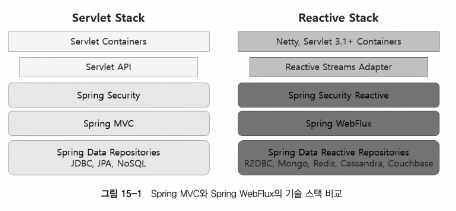
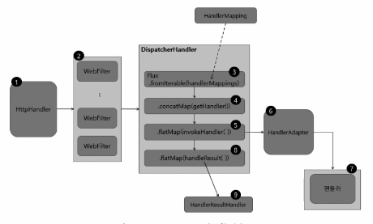
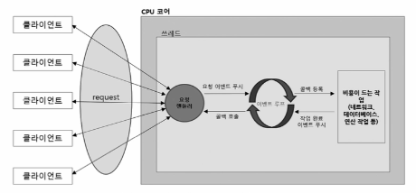

# Spring WebFlux 개요

- 서버
  - Tomcat / Netty
  - Servlet API / Netty
  - Servlet Filter + Spring Security / WebFilter + Spring Security
  - JDBC / R2DBC

- 요청처리 흐름
  1. 요청이 들어오면 Netty 등의 서버 엔진을 거쳐 HttpHandler 가 들어오는 요청을 전달 받음
     - HttpHandler 는 Netty 이외의 다양한 서버 엔진에서 지원하는 서버 API 를 추상화 
     - `ServerHttpRequest`, `ServerHttpResponse` 를 포함하는 `ServerWebExchange` 를 생성한 후 WebFilterChain 을 통해 전달
  2. `ServerWebExchange` 는 WebFilterChain 에서 전처리 과정을 거친 후 `WebHandler` 인터페이스의 구현체인 `DispatcherHandler` 에게 전달
  3. DispatcherServlet 과 유사한 `DispatcherHandler` 는 `HandlerMapping` List 를 원본 Flux 의 소스로 전달 받음
  4. `ServerWebExchange` 를 처리할 핸들러를 조회
  5. 조회한 핸들러의 호출을 `HandlerAdapter` 에게 위임
  6. `HandlerAdapter` 는 `ServerWebExchange` 를 처리할 핸들러를 호출
  7. Controller 또는 HandlerFunction 형태의 핸들러에서 요청을 처리한 후 응답 데이터를 리턴
  8. 핸들러로부터 리턴 받은 응답 데이터를 처리할 HandlerResultHandler 를 조회
  9. 조회한 HandlerResultHandler 를 통해 response 로 리턴

- Spring WebFlux 핵심 컴포넌트
  - `HttpHandler`
    - Request 와 Repsonse 를 처리하기 위해 추상화된 단 하나의 메서드만을 가짐
    - `Mono<Void> handle(ServerHttpRequest request, ServerHttpResponse response)`
    - `HttpWebHandlerAdapter` 는 HttpHandler 의 구현체
      - handle 메서드의 파라미터로 전달받은 ServerHttpRequest / ServerHttpResponse 로 ServerWebExchange 를 생성항 후 WebHandler 호출
  - `WebFilter`
    - Servlet Filter 처럼 핸들러가 요청을 처리하기 전에 전처리 작업을 할 수 있도록 해줌
    - `Mono<Void> filter(ServerWebExchange exchange, WebFilterChain chain)`
    - 모든 핸들러 (애너테이션, 함수형) 에 적용할 수 있음
  - `HandlerFilterFunction`
    - 함수형 기반의 요청 핸들러에 적용할 수 있는 Filter
    - `Mono<R> filter(ServerRequest request, HandlerFunction<T> next)`
    - 함수형에서만 동작
  - `DispatcherHandler`
    - WebHandler 인터페이스의 구현체, DispatcherServlet 이 하는 일과 유사
    - DispatcherHandler 자체가 Spring Bean 으로 등록되며, ApplicationContext 에서 HandlerMapping, HandlerAdapter, HandlerResultHandler 를 조회
    - `DispatcherHandler.java` 주요 메서드
      - `initStrategies(ApplicationContext context)`
        - ApplicationContext 에서 HandlerMapping, HandlerAdapter, HandlerResultHandler 를 조회 후 List 로 생성
      - `handle(ServerWebExchange exchange)`
        - List<HandlerMapping> 을 Flux.fromIterable Operator 의 data source 로 사용, getHandler 메서드를 통해 매치되는 handler 중에서 첫 번째 핸들러를 사용
        - `invokeHandler(ServerWebExchange exchange, Object handler)` 를 통해 핸들러 호출을 위임
        - `handleResult(ServerWebExchange exchange, HandlerResult result)` 를 통해 핸들러의 리턴 값을 response 에 적용
  - `HandlerMapping`
    - MVC 와 마찬가지로 request 와 handler object 에 대한 매핑을 정의하는 interface
    - 구현 클래스
      - `RouterFunctionMapping`, `RequestMappingHandlerMapping` 등
  - `HandlerAdapter`
    - MVC 와 마찬가지로 handler object 를 호출하고, 그 결과를 Mono<HandlerResult> 로 받는다
    - 구현 클래스
      - `RequestMappingHandlerAdapter`, `HandlerFunctionAdapter`, `SimpleHandlerAdapter`, `WebSocketHandlerAdapter` 등
- Spring WebFlux 의 Non-Blocking 프로세스 구조
  - thread pool 을 사용하는 MVC 와는 달리 스레드가 차단되지 않기 때문에 적은 수의 고정된 스레드 풀을 사용해서 더 많은 요청을 처리한다.
  - Event Loop 을 사용하기 때문에 위와 같은 처리가 가능
  - 
  
    - Non-Blocking process
      1. 클라이언트로부터 들어오는 요청을 요청 핸들러가 전달받는다.
      2. 전달받은 요청을 이벤트 루프에 푸시한다.
      3. 이벤트 루프는 네트워크, 데이터베이스 연결 작업 등 비용이 드는 작업에 대한 콜백을 등록
      4. 작업이 완료되면 완료 이벤트를 이벤트 루프에 푸시한다.
      5. 등록한 콜백을 호출해 처리 결과를 전달한다.
    - 이벤트 루프는 단일 스레드에서 실행되며 NetworkIO DBIO 등의 이벤트에 콜백을 등록함과 동시에 다음 이벤트 처리로 넘어간다.
- Spring WebFlux 의 스레드 모델
  - Non-Blocking IO 를 지원하는 Netty 등의 서버 엔진에서 적은 수의 고정된 크기의 스레드(일반적으로 CPU 코어 개수만큼의 스레드)를 생성해서 대량의 요청을 처리한다.
  - 만약 이벤트 처리 중 복잡한 연산을 하거나 Blocking 되는 지점이 존재한다면 오히려 성능이 저하될 수 있다.
    - 이럴 때에는 서버 엔진에서 제공하는 스레드 풀을 사용하는 것이 아닌 Scheduler 를 사용하면 효과적인 처리가 가능