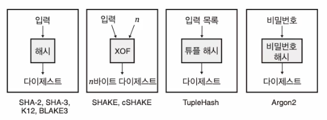

# hash
- 해시 함수란?
  - 제2 역상 저항성
    - digest 는 입력과 1:1 대응이다.
  - 충돌 저항성
    - 두 개의 서로 다른 메시지가 같은 digest 를 가질 확률은 매우 낮다.
  - 결정론적
    - 같은 입력에 대해 항상 같은 출력을 내보낸다.
- 해시 함수의 보안 속성
  - 역상 저항성
    - 어떤 digest 값이 주어졌을 때, 이 digest 값을 만들어낸 입력으로 바꾸는 역함수를 누구도 만들 수 없다는 성질
  - 제2 역상 저항성
    - 입력과 입력에 해당하는 digest 가 주어졌을 때 해당 digest 를 생성하는 다른 입력을 찾을 수 없다는 뜻
  - 충돌저항성
    - 동일한 출력을 만드는 두개의 다른 입력을 생성할 수 없도록 보장
- 해시 함수의 보안 제약 (digest 의 길이)
  - 해시 충돌이 없기 위해 최소 출력 크기 256bit (32 byte)
  - 역상 저항성 및 제2 역상 저항성을 위해서는 128bit (16 byte) 이상이 필요
- 해시 함수의 실사용
  - 보통 단독으로 쓰이지 않는다.
  - 커밋 (약정)
    - 특정 문장을 해시 함수에 넣어서 digest 를 만들어서 저장하는 것 => 기간 동안 해당 문장을 변경하지 않았음을 증명
    - 숨기기 : 커밋은 기본값을 숨겨야 한다.
    - 바인딩 : 커밋은 하나의 값을 숨겨야 한다. 즉 값 x 로 커밋하면 나중에 다른 값 y 가 나올 수 없다.
  - 서브리소스 무결성
    - CDN 에서 파일을 받을 때, 파일의 digest 를 받아서 파일이 변조되지 않았음을 확인
  - 비트토렌트
    - 피어는 파일을 배포하기 위해 파일을 청크로 자르고 각 청크를 개별적으로 해시
    - 청크의 해시는 다운로드할 파일을 나타내는 신뢰의 원천으로서 공유된다.
  - 토르
    - 도메인에 공개키를 digest 로 제공
  - 대개 인증할 때 사용함
- 표준화된 해시 함수
  - MD5, SHA-1 은 보안에 취약, 뚫렸음...
  - SHA-2
    - 아래는 각각 digest 의 길이
    - SHA-224, 256, 384, 512 bit
    - SSA-512/224, 512/256 은 512 의 결과를 잘라서 224/256 의 결과를 만들어낸다.
    - 작동 원리
      - 압축 함수, compression function : 어떤 크기의 두 입력을 받아서 한쪽 입력의 크기에 해당하는 하나의 출력을 생성
      - SHA-2 는 블록 암호, block cipher(고정 크기의 데이터 블록을 암호화할 수 있는 암호) 에 의존하는 데이비스-메이어 방법 사용
      - SHA-2 는 압출 합수를 반복적으로 호출하여 메시지를 해시하는 알고리즘인 머클-담고르 구조
        - 해시하려는 입력에 패딩을 적용하여 입력을 압축 함수에 맞는 블록으로 자름
        - 압축 함수의 이전 출력을 압축 함수에 대한 두 번째 인수로 사용하여 압축 함수를 메시지 블록에 반복적으로 적용 => digest
        - 참고 : 처음에는 초기값 (nothing-up-my-sleeve) 을 사용
  - SHA-3
    - sha-3-224, 256, 384, 512
    - 순열 위에 구축된 암호화 알고리즘
    - 모든 순열은 가역적이므로 출력으로부터 입력을 찾을 수 없다.
    - sha-3 는 스펀지 구조로 제작되었다.
      - 입력을 받아 동일한 크기의 출력을 반환하는 keccak-f 라는 순열을 사용 (AES 와 유사)
      - 입력과 출력을 r(rate), c(capacity) 로 나누어서 사용
      - 순열 입력의 r 과 입력을 XOR, C 는 하지 않는다.
      - 필요한 경우 입력에 패딩을 추가하고 입력을 r만큼의 크기의 블록으로 나눈다.
      - 순열 입력으로 각 블록을 XOR 하고 각 블록이 XOR된 후 상태를 순열하면서 순열을 반복적으로 호출한다. => 마지막이 digest 가 된다.
      - 흡수 : 입력을 받는 과정, 스퀴즈 : 출력을 내보내는 과정
  - XOF, SHAKE, cSHAKE
    - XOF : 출력이 가변적인 해시 함수
      - SHAKE : SHA-3 와 구조가 동일하지만 속도가 더 빠르며 스퀴즈를 원하는 만큼 순열 연산할 수 있음, 가변적 출력
      - cSHAKE : 커스텀 문자열을 받을 수 있는 shake, 각주 : salt 값을 다르게 준다는건듯
  - 튜플해시
    - cSHAKE 기반
    - cSHAKE 는 단일 메세지, 튜플 해시는 목록을 해싱함
- 비밀번호 해시
  - 비밀번호를 해시하고 digest 만 저장
    - 검증은 저장된 digest, 새로 해시한 digest 를 비교 => 심층 방어, defense in depth
  - brute force, exhaustive search 공격을 방지
    - 한 번에 하나의 해시된 암호만 공격할 수 있도록 속도를 떨어뜨려야한다.
      - 솔트로 해결할 수 있음
        - 같은 비밀번호라도 다른 솔트를 사용하면 다른 digest 가 나온다.
        - 솔트를 사용하면 레인보우 테이블을 사용한 공격을 방지할 수 있다.
    - 해시 함수는 빨라야하지만 공격자는 이를 악용하여 brute force 감행
      - 의도적으로 느린 암호 해시 로 해결할 수 있음
        - 표준 : Argon2, 비표준 : bcrypt, scrypt

 

- hash 함수 도식화