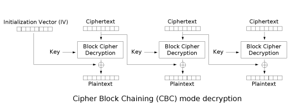

# 인증 암호화
- 암호문이란?
  - 암호화 알고리즘이 필요한 두가지
    - 비밀키 : 예측할 수 없고 임의적인 특성을 지니며 잘 보호되어야 한다.
    - 평문 : 암호화하려는 내용
  - 복호화에 필요한 요소 두가지
    - 비밀키 : 암호문을 생성하는 데 사용한 것과 동일한 비밀 키, 대칭 암호화
    - 암호문 : 수신한 암호화된 메세지
- AES 블록 암호화
  - AES(Advanced Encryption Standard) : 미국 국가표준으로 지정된 암호화 알고리즘
  - AES 가 제공하는 보안의 수준
    - AES-128 : 128비트 키를 사용하는 암호화 알고리즘
    - AES-192 : 192비트 키를 사용하는 암호화 알고리즘
    - AES-256 : 256비트 키를 사용하는 암호화 알고리즘
    - 키가 크면 클수록 더 강력해진다.
    - 비트 보안, bit security
      - 비트 보안이 높을수록 더 많은 비트를 사용해야 한다.
      - AES-128 은 128비트 키를 사용하므로 2^128 만큼의 시도가 필요하다. => 대부분의 애플리케이션에서 목표로 함
  - AES 의 인터페이스
    - 알고리즘은 가변 길이 키를 사용한다.
    - 정확히 128비트 평문을 사용한다.
    - 정확히 128비트의 암호문을 출력한다.
    - AES 는 고정된 크기의 평문을 암호화하기 때문에 블록 암포, block cipher 라 한다.
    - 복호화 작업은 이와 정확히 반대
      - 복호화는 암호화를 되돌린다.
      - 키가 있는 블록 암호는 순열, 가능한 모든 평문을 가능한 모든 암호문에 매핑한다, 암호문에서 평문으로 돌아가는 매핑이 존재한다.
  - AES 의 내부
  - 
  - AES 는 평문의 상태를 4x4 행렬로 표현한다.
  - 
  - 내부적으로 AES 는 고정 크기 블록을 암호화하는 대칭 암호학 프리미티브인 블록 암호처럼 작동한다.
  - AES 는 원래 입력(평문) 에서 시작하여 여러번 반복하는 라운드 함수가 있다.
    - 라운드 함수를 호출할 때마다 상태가 계속 바뀌고 결국 암호문이 생성된다.
    - 각 라운드는 기본 대칭키에서 파생된 다른 라운드 키를 사용한다 (key schedule)
- 암호화된 펭귄, 그리고 CBC 모드
  - 정확히 128비트가 아닌 것을 암호화하려면 패딩, 그리고 작동 모드를 사용해야 한다.
  - 16바이트 블록으로 나눴을 때 나눠진 평문의 마지막 블록이 16바이트보다 작은 경우 평문의 길이가 16바이트가 될 때까지 끝에 바이트를 더 추가한다.
  - 패딩 메커니즘
    - PKCS#7
      - 각 패딩 바이트의 값은 필요한 패딩 길이로 설정되어야 한다.
      - 평문이 8바이트고 필요한 바이트가 8이라면 끝에 08 을 8번 추가한다.
      - 이러한 패딩은 ECB 펭귄 문제가 발생한다. (반복적인 패턴을 유추할 수 있음)
  - 암호 블록 연쇄, cipher block chaining, cbc
    - 
    - 암호화를 무작위화 하기 위해 (반복적인 패턴을 유추할 수 없기 위해) IV initialization vector 를 사용한다.
    - 16 byte 의 IV 를 생성한 다음 IV 를 암호화하기 전에 평문의 첫 16바이트와 XOR 한다.
    - 암호화할 평문이 더 있다면 이전 암호문을 사용하여 암호화하기 전에 평문의 다음 블록과 xor 한다.
    - 
    - 복호화할 때는 반대로 한다.
    - IV 는 고유해야하며, 예측할 수 없어야 한다.
- 인증이 필요하면? AES-CBC-HMAC
  - IV 는 공개되어 있으므로 암호시 공격에 취약하다.
  - IV 와 암호문을 HMAC 하여 확인하는 방법을 사용
- 올인원 구조 : 인증 암호화
  - 연관 데이터 인증 암호화, AEAD, Authenticated Encryption with Associated Data
    - 
    - AES-CBC-HMAC 과 유사하게 수정 사항을 감지하며 평문의 기밀성을 유지하며 연관 데이터를 인증하는 방법 제공
    - 각주 : hmac 이랑 뭐가 다른지 모르겠음...
    - AES-GCM, AES-CCM, ChaCha20-Poly1305
- 요약
  - 암호화(또는 대칭 암호화)는 데이터의 기밀성을 보호하는 데 사용할 수 있는 암호학 프리미티브, 보안은 비밀로 유지해야 하는 대칭 키에 의존한다.
  - 대칭 암호화는 보안을 위해 인증되어야 한다. 그렇지 않으면 암호문이 변조될 수 있다.
  - 인증 암호화는 메시지 인증 코드를 사용하여 대칭 암호화 알고리즘으로 구성될 수 있다. -> AEAD 는 오용하기 어려운 올인원 구조를 갖추므로 추천된다.
  - 두 당사자가 동일한 대칭 키를 알고 있으면 인증 암호화를 사용하여 통신을 숨길 수 있다.
  - 논스를 재사용하면 AES-GCM 및 ChaCha20-Poly1305 의 인증이 중단된다.