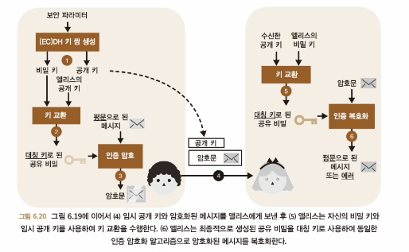

# 비대칭 암호화와 하이브리드 암호화

- 비대칭 암호화란?
  - 대칭 암호화의 단점을 보완하기 위해 고안된 암호화 방식
    - 대칭 암호화의 단점: 키를 전달하는 과정에서 키가 유출될 수 있음
  - 키 생성 알고리즘을 통해 key pair 를 만들어냄
    - public : 송신자측 사용, plaintext 를 암호화
    - private : 수신자측 사용, ciphertext 를 복호화
- 실전 비대칭 암호화와 하이브리드 암호화
  - 키 교환
    - 비대칭 암호화 프리미티브를 사용하여 키 교환을 수행하는 것
    - KEM : 대칭키를 생성한 후 상대방의 공개키로 암호화
    - 
  - 하이브리드 암호화
    - 더 큰 메시지를 암호화하기 위해 대칭 암호화와 비대칭 암호화를 결합한 방식
    - 
    - 대칭키를 enc 하기 전에 plaintext 를 ciphertext 로 암호화하고 키는 kem 사용해서 두개 같이 보냄
- RSA 비대칭 암호화 : 최악과 차악
  - RSA-OAEP : RSA 를 사용하여 비대칭 암호화를 수행하는 주요 표준
  - ECIES : ECDH 로 하이브리드 암호화를 수행하는 주요 표준
  - 
  - RSA 가 작동하는 방식
    1. 두개의 큰 소수 p, q 를 생성
    2. 임의의 공개 지수 e, 또는 e = 65537 과 같은 고정 지수를 선택
    3. 공개 키는 공개 지수 e 와 공개 모듈러스 N = p x q
    4. 비밀 지수 d = e^-1 mod (p-1)(q-1) 를 유도
    5. 비밀 키는 비밀 지수 d
    6. 메세지 암호화를 위해 message^e mod N 을 계산
    7. 암호화 복호화를 위해 ciphertext^d mod N 을 계산
- 각주
  - tls 버전 별 암호화 방식
  - tls1.0, tls1.1 : RSA, DHE, ECDHE
  - tls1.2 : RSA, DHE, ECDHE
  - tls1.3 : DHE, ECDHE, PSK