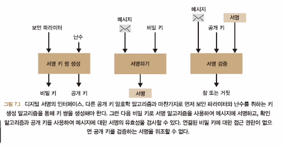

# 서명과 영지식 증명
- 서명
  - 나만의 서명을 사용하여 임의의 메시지에 서명할 수 있다.
  - 누구나 메시지에서 서명을 확인할 수 있다.
- 서명 체계의 세가지 알고리즘
  - 서명자가 새로운 비밀 키와 공개 키를 생성하는 데 필요한 키 쌍 생성 알고리즘 
  - 비밀 키와 메시지를 사용하여 서명을 생성하는 서명 알고리즘
  - 공개 키, 메시지, 서명을 사용하여 성공 또는 오류 메시지를 반환하는 확인 알고리즘
  - 
  - 서명은 메시지의 원본과 메시지의 무결성을 인증하는 데 유용하다.
    - 원본 : 내 서명이 있는 경우 내가 보낸 것이다.
    - 무결성 : 누군가가 메시지를 수정하면 서명이 무효화된다.
  - 서명의 주된 사용 : 인증된 키 교환
    - 각주 : tls 디지털 인증서
- 서명을 위한 다양한 표준
  - RSA PKCS#1 v1.5 는 널리 사용되지만 올바르게 구현하기 어렵기 때문에 권장하지 않음
  - RSA-PSS 는 구현하기 쉽고 보안 증명이 있으므로 더 나음, 하지만 네트워크 프로토콜에 적합하지 않음
  - 현재 가장 널리 사용되는 서명 체계는 ECDSA, EdDSA 와 같은 타원 곡선 기반
  - 서명이 일반적이지 않은 방식으로 사용되는 경우 일부 미묘한 속성으로 인해 위험할 수 있음
    - 일부 서명 체계는 키 대체 공격에 취약하기 때문에 누가 메시지에 서명했는지에 대한 모호성을 항상 피해야 함
    - 외부 행위자는 메시지에 대해 이미 존재하는 서명의 유효성을 검사하는 새 키 쌍을 만들거나 지정된 서명을 검증하는 새 키 쌍과 새 메시지를 만들 수 있다.
    - 서명의 고유성에 의존하면 안된다.
      - 대부분의 서명 체계에서 서명자는 동일한 메시지에 대해 임의의 서명을 만들 수 있다.
      - 외부 행위자는 서명을 받아서 동일한 메시지에 대해 다른 유효한 서명을 만들 수 있다.