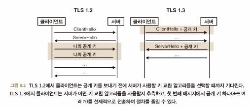
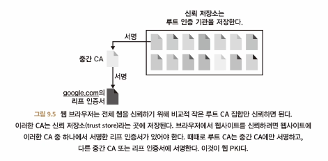
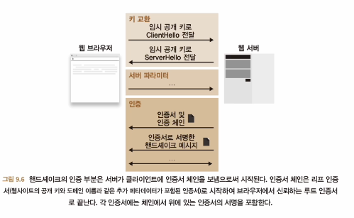

# 보안 전송
- SSL 과 TLS
  - 90년대 TLS의 전신인 SSL, Secure Sockets Layer 프로토콜이 탄생
  - SSL 은 다양한 상황에 사용될 수 있지만 처음에는 브라우저를 위해 만들어졌다
  - HTTP -> HTTPS
  - SSL 에서 TLS 로
    - 웹 사실 표준
    - SSL 의 모든 버전은 취약점이 있음
    - SSL 3.0 -> TLS 1.0, RFC 2246
    - 가장 최신, TLS 1.3(2018년 게시), RFC 8446
  - 실전에서 TLS 활용하기
    - CLIENT / SERVER
    - TLS 클라이언트를 빌드하려면 아래의 2가지 요소가 필요
      - 설정
        - 클라이언트는 지원하려는 SSL, TLS 버전
        - 연결 보안을 위해 사용할 암호화 알고리즘
        - 서버 인증 방법
      - 연결하려는 서버에 대한 정보
        - 최소한 IP 주소와 PORT
        - 정규화된 도메인
      - 위 두가지가 갖춰지면 secure session 을 생성할 수 있다.
      - TLS 서버는 클라이언트의 설정과 유사한 설정만 취하기에 훨씬 더 간단하다
- TLS 프로토콜의 작동 원리
  - 고수준에서 본 두단계
    - 핸드셰이크 단계
      - 결국 키 교환이다.
      - 두 참가자가 대칭 키 세트에 동의하는 것으로 끝난다.
    - 핸드세이크 후 단계
      - 인증된 암호화 알고리즘, 핸드세이크가 끝날 때 생성된 키 집합을 사용
  - TLS 핸드세이크
    - 핸드세이크의 네가지 속성
      - 협의
        - 알고리즘 협의
          - 
          - 하나 이상의 키 교환 알고리즘
          - 두개 이상의 전자 서명 알고리즘
          - HMAC, HKDF 와 함께 사용할 하나 이상의 해시 함수
          - 하나 이상의 인증된 암호화 알고리즘
        - 각주 : tls 1.3 에서 키교환시 rsa 는 제거되었음(주로 ecdhe 사용), 다만 전자 서명은 rsa 를 사용할 수 있음 
      - 키교환
        - 어떤 키 교환 알고리즘을 사용할 것인가?
      - 인증
        - Root CA
        - 웹 PKI
          - 
          - 사용자가 실제로 웹사이트와 핸드세이킹을 확인하는지에 대한 수단
          - 웹 PKI 의 두 부분
            - 브라우저는 CA 라는 루트 공개 키 세트를 신뢰
            - 웹사이트는 CA 로부터 인증(자신의 서명 공개 키 서명)을 얻기 위해 특정 도메인을 소유하고 있음을 증명
          - 대화 중인 서버가 실제로 웹사이트인지 확인하는 방법
            - 서버는 TLS 핸드세이크 중 인증서 체인을 보낸다.
              - 인증서 체인
                - 도메인 이름, 장기 서명 공개 키, CA 서명을 포함하는 리프 인증서
                - 인증서에 서명한 인증서에서 마지막 중간 CA 에 서명한 루트 CA 까지의 중간 CA 인증서 체인
        - 
      - 세션 재개
        - PSK handshake, pre-shared key
          - 클라이언트가 ClientHello 메시지에 PSK 식별자 목록을 지원한다고 알림으로써 작동
          - 서버가 PSK ID 중 하나를 인식하면 응답에서 이를 알림
          - 이 경우 인증 단계를 건너뛰며 핸드세이크를 완료
- 암호화된 웹의 현재
  - TLS 1.2, 1.3 이 아닌 모든 SSL, TLS 의 사용 중단 추진 중
  - 잘못된 인증서를 처리하는 2가지 메커니즘
    - CRL, Certificate Revocation List
      - CA 가 인증서를 취소하면 CRL 에 추가
      - 클라이언트는 CRL 을 다운로드하여 인증서가 유효한지 확인
      - 더 이상 사용되지 않는다
    - OCSP, Online Certificate Status Protocol
      - 인증서가 유효한지 확인하기 위해 CA 에 직접 요청
