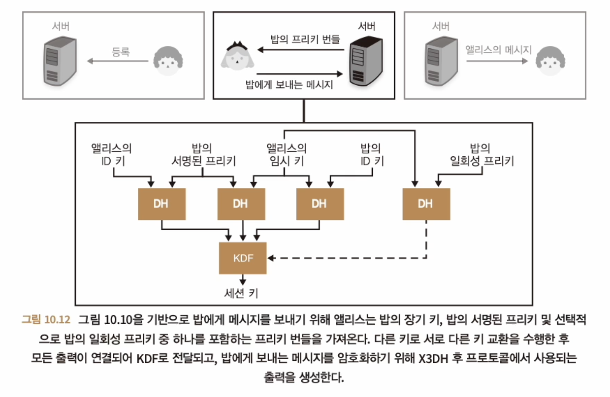

# 종단 간 암호화
- 네트워크 홉 중간에 통신 중 데이터가 노출되는 것을 방지하기 위해 종단 간 암호화를 사용한다.

## root of trust
- 핵심적인 신뢰의 출발점
  - 대체로 하드웨어 칩이나 소프트웨어 모듈로 구현된다.
  - key pair

## 보안 메시징, 시그널을 활용한 현대적 종단 간 암호화
- TOFU, Trust On First Use
  - 처음 서비스, 서버에 접속할 때 서버의 신원 정보(공개키)를 받아들임
  - 그 이후 모든 통신에서 정보를 신뢰하는 방식
  - 향후 변경되는 정보에 대해서 모두 거부함
- 시그널 프로토콜의 핸드셰이크, X3DH
  - 비동기적인 메시징 환경에서도 안정한 통신을 가능하게 함
  - X3DH : Extended Triple Diffie-Hellman
    - 3가지 DH 키 교환을 사용하여 종단 간 키 교환을 수행
    - 3가지 DH 키 교환
      - 1. Prekey : 상대방의 장치가 오프라인일 때 사용, 일회성 사용
      - 3. Signed prekey : 상대방의 장치가 온라인일 때 사용, 중기 사용
      - 2. Identity key : 상대방의 장치가 온라인일 때 사용, 장기 사용
    - 
    - 
      
      - 각주 : tls chain 이나 kms 랑 비슷한 방식이지 않나...
    - x3dh 는 3개 의 dh 키 교환으로 구성되며 하나로 그룹화된다.
      1. 앨리스의 ID 키와 밥의 서명된 프리키
      2. 앨리스의 임시 키와 밥의 ID 키
      3. 앨리스의 임시 키와 밥의 서명된 프리키
      4. 밥에게 여전히 사용 가능한 일회성 프리키가 있는 경우 밥의 일회성 프리키와 앨리스의 임시 키
    - 
- 시그널의 핸드셰이크 후 프로토콜, 더블 래칫
  - 메시지를 보낼 때마다 체인 키를 래칫(전달)하고 메시지를 수신할 때마다 다른 체인 키를 래칫함
    - 위를 통해 과거의 암호키가 노출되어도 이전에 전송된 메시지들이 노출되지 않도록 보호
    - 미래에 키가 손상되더라도 이전 메시지의 보안성을 유지할 수 있도록 함
    - DH 로 키를 교환했기 때문에 가능