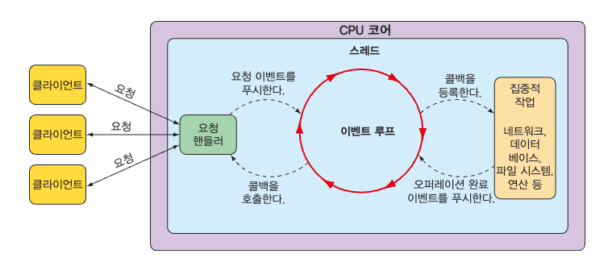
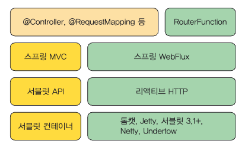

# chap 11 - reactive api 개발하기
- spring 5 / webflux

## Spring WebFlux
- spring mvc 는 servlet 기반으로 동작 -> blocking io / multi thread
  - thread pool 을 이용하여 작업, blocking io 를 처리 (내장 tomcat 의 경우 200개의 thread pool 을 기본으로 제공)
  - thread context switching 으로 인한 cost 발생
  - 끊임 없는 HTTP 통신을 하는 모델에서는 비효율적
- event loop
  - 더 적은 수의 스레드(일반적으로 CPU 코어 당 1)
  - 클라이언트가 요청하면 이벤트 루프가 요청을 처리
  - Non-blocking I/O 으로 병행
    - 비동기적으로 작업을 처리하고, 작업이 완료되면 이벤트 루프가 결과를 반환
    - 작업이 완료되기 전에는 이벤트 루프가 다른 요청을 처리
    - 
- Spring WebFlux
  - spring 5 에서 reactive programming 을 지원하기 위해 추가
  - spring 에는 if 문 분기로 reactive 하게 제공해야 되는지가 포함되어있음 
    - 이것이 spring webflux
  - 

    - spring MVC / spring webflux
    - servlet API / reactive Http
    - servlet container(tomcat) / netty
    - spring mvc 에서도 mono, flux 를 사용할 수 있지만, blocking io(혹은 다중스레드로 동작) 를 사용하기 때문에 reactive 하지 않음

## 함수형 요청 핸들러
- spring 에서 제공하는 애노테이션은 무엇 / 어떻게 해야하는지를 정의하는 데 괴리가 있다.
  - 애노테이션 자체는 무엇 / 어떻게는 프레임워크 어딘가에 있다
  - 또한 이런 애노테이션의 debugging 은 까다롭다
  - 이에 대한 대안으로 함수형 요청 핸들러를 사용할 수 있다.
- API 작성에 대한 네가지 타입
    - RequestPredicate : 처리될 요청의 종류를 선언한다.
    - RouterFunction : 요청이 어떻게 핸들러에게 전달되어야 하는지를 선언한다.
    - ServerRequest : HTTP 요청을 나타내며, 헤더와 몸체 정보를 사용할 수 있다.
    - ServerResponse : HTTP 응답을 나타내며, 헤더와 몸체 정보를 포함한다.
- `RouterFunctionConfig` 참고

## Spring WebFlux security
- <a href="https://docs.spring.io/spring-security/reference/reactive/authorization/authorize-http-requests.html">공식문서</a>
- `SecurityConfig` 참고
- WebSecurityConfigurerAdapter 를 상속하지 않고, 다른 베이스 클래스를 상속하지 않고 configure() 메서드를 구현하지도 않는다.
  - 단지 securityWebFilterChain() 메서드를 갖는 SecurityWebFilterChain 타입의 빈을 정의한다.
  - HttpSecurity 대신 ServerHttpSecurity 를 사용하여 구성을 선언한다.
  - authorizeExchange 는 authorizeRequests 와 같은 역할을 한다.
  - 