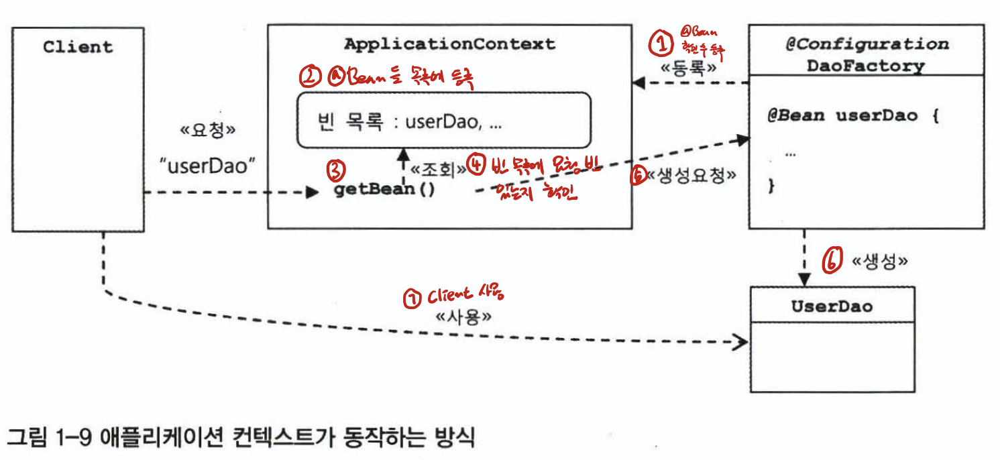

# 오브젝트와 의존 관계

```java
public class User {
    private String id;
    private String name;
    private String password;

    public String getId() {
        return id;
    }

    public void setId(String id) {
        this.id = id;
    }

    public String getName() {
        return name;
    }

    public void setName(String name) {
        this.name = name;
    }

    public String getPassword() {
        return password;
    }

    public void setPassword(String password) {
        this.password = password;
    }
}
```

```java
    public void add(User user) throws ClassNotFoundException, SQLException {
        Class.forName("com.mysql.jdbc.Driver");
        Connection c = DriverManager.getConnection("jdbc:mysql://localhost/springbook", "root", "");

        PreparedStatement ps = c.prepareStatement("insert into users(id, name, password) values (?, ?, ?)");
        ps.setString(1, user.getId());
        ps.setString(2, user.getName());
        ps.setString(3, user.getPassword());

        ps.executeUpdate();

        ps.close();
        c.close();
    }

    public User get(String id) throws ClassNotFoundException, SQLException {
        Class.forName("com.mysql.jdbc.Driver");
        Connection c = DriverManager.getConnection("jdbc:mysql://localhost/springbook", "root", "");

        PreparedStatement ps = c.prepareStatement("select * from users where id = ?");
        ps.setString(1, id);

        ResultSet rs = ps.executeQuery();
        rs.next();

        User user = new User();
        user.setId(rs.getString("id"));
        user.setName(rs.getString("name"));
        user.setPassword(rs.getString("password"));

        rs.close();
        ps.close();
        c.close();

        return user;
    }
```

- 위의 DAO 는 아주 한심

## DAO 의 분리
- 오브젝트에 대한 설계와 이를 구현한 코드는 매번 변한다.
    - 끝이란 개념은 없다.
    - 미래에 어떻게 대비해야 할 것인가.
- 변화는 대체로 집중된 한 가지 관심에 대해 일어나지만 그에 따른 작업은 한 곳에 집중되지 않는 경우가 많다.
    - DB 접속용 암호를 변경하려고 DAO 클래스 수백 개를 모두 수정...

- 관심사의 분리
    - 관심이 같은 것끼리는 모으고, 관심이 다른 것은 따로 떨어져 있게 해야 한다.

### 커넥션 만들기의 추출
- UserDao 의 관심사항
    - Db 연결과 커넥션
        - 드라이버, 로그인 정보, 커넥션 생성 방법
    - SQL -> Statement
        - 바인딩
    - 작업이 끝나면 close

```java
public User get(String id) throws ClassNotFoundException, SQLException {
    Connection c = getConnection();
    // ...
}

private Connection getConnection() throws ClassNotFoundException, SQLException {
    Class.forName("com.mysql.jdbc.Driver");
    Connection c = DriverManager.getConnection("jdbc:mysql://localhost/springbook", "root", "");
    return c;
}
```

- 위와 같은 식으로 connection 빼줌
    - add, get 에 connection 을 가져오는 하나의 관심사가 중복되어 꼬일 수 있음
    - Connection 관련 정보 수정 쉬움

### DB 커넥션 만들기의 독립
- 상속을 통한 확장
    - getConnection 을 추상 메소드로 만든다.
    - 템플릿 메소드 패턴을 사용해서

## DAO 의 확장
- 관심이 바뀌면 변경이 일어난다.
    - JDBC API 를 쓸건지 DB 전용 API 를 쓸 건지..
    - 어떤 테이블의 이름과 필드 이름을 사용해 어떤 SQL 을 만들건지...
- 추상 클래스를 만들고 (템플릿 메소드 패턴) 이를 상속한 서브 클래스에서 변화가 필요한 부분을 바꿔서 슬 수 있게 만든 이유는 바로 이렇게 변화의 성격이 다른 것을 분리해서 서로 영향을 주지 않은 채로 필요한 시점에 독립적으로 변경할 수 있게 하기 위함
    - 상속은 단점도 많다.

### 클래스의 분리
- 본격적으로 분리
- 독립적으로 만들고 UserDao 가 사용하게 한다.

```java
public class SimpleConnectionMaker {
    public Connection makeNewConnection() throws ClassNotFoundException, SQLException {
        Class.forName("com.mysql.jdbc.Driver");
        Connection c = DriverManager.getConnection("jdbc:mysql://localhost/springbook", "root", "");
        return c;
    }
}
```

- connection 만들던 함수를 아예 SimpleConnectionMaker 로 빼서 composition 으로 씀


### 인터페이스의 도입
- connectionmaker interface 로 만들어서
    - 추상화해서 구현체 따로 둠

```java
public interface ConnectionMaker {
    public Connection makeConnection() throws ClassNotFoundException, SQLException;
}

public class NConnectionMaker implements ConnectionMaker {
    @Override
    public Connection makeConnection() throws ClassNotFoundException, SQLException {
        Class.forName("com.mysql.jdbc.Driver");
        Connection c = DriverManager.getConnection("jdbc:mysql://localhost/springbook", "root", "");
        return c;
    }
}
```

- 인터페이스는 그 기능을 어떻게 구현했는지에 대해 알 필요 없음

### 관계설정 책임의 분리
- 구현체를 선택하는 관심사 -> 독립하지 않으면 확장 어려움
    - DI
        - method (setter)
        - constructor
        - Object 사이의 dynamic 한 관계가 만들어진다.
```java
public UserDao(ConnectionMaker connectionMaker) {
    this.connectionMaker = connectionMaker;
}
```

- UserDao 는 자신의 관심사이자 책임인 사용자 데이터 액세스 작업을 위해 SQL 을 생성하고 실행하는 데 집중
    - DB 생성, 전략에 고민하지 않음
    - 상속보다 composition 이 훨씬 유연하다.

### 원칙과 패턴
- 개방 폐쇄 원칙 OCP Open-Closed Principle
    - 클래스나 모듈은 확장에는 열려 있고, 변경에는 닫혀 있어야 한다.
    - UserDao 는 DB 연결 방법이라는 기능을 확장하는 데는 열려 있다.
    - 자신의 핵심 기능을 구현한 코드는 그런 변화에 영향을 받지 않고 유지할 수 있으므로 변경에는 닫혀 있다.
- 높은 응집도와 낮은 결합도
    - 응집도가 높다 -> 하나의 모듈, 클래스가 하나의 책임 또는 관심사에 집중
        - 불필요하거나 관련 없는 책임에 얽혀 있지 않음
    - 높은 응집도
        - 변화가 일어날 때 해당 모듈에서 변하는 부분이 크다는 것
        - 다른 클래스에 영향을 미치지 않는다 (수정을 요구하지 않는다.).
    - 낮은 결합도
        - 책임과 관심사가 다른 오브젝트 또는 모듈과는 느슨히 연결된 형태 유지
        - composition
    - 전략 패턴
        - 자신의 context 에서 필요에 따라 변경
        - UserDao 의 ConnectionMaker 에 어떤 구현체를 선택해 할당할 것인가.

## IoC
- Inversion of Control

## 팩토리
- 구현체를 선택하는 것에 대해 제공
- 객체를 생성하는 방법을 결정하고 그렇게 만든 객체를 return

```java
public class DaoFactory {
    public UserDao userDao() {
        NConnectionMaker nConnectionMaker = new NConnectionMaker();
        return new UserDao(nConnectionMaker);
    }
}

// main
UserDao userDao = new DaoFactory().userDao();
```

- NConnection 만들어서 UserDao return
- main 에서는 어떤 구현체를 선택할지 고민하지 않아도 됨

### 설계도로서의 팩토리
- UserDao 와 ConnectionMaker 는 각각 핵심적인 데이터 로직과 기술 로직을 담당
- DaoFactory 는 오브젝트들을 구성하고 관계 정의
    - 설계도 같은 역할

### 제어권의 이전을 통한 제어관계 역전
- 프로그램 제어 흐름 구조가 뒤바귀는 것
- 오브젝트가 자신이 사용할 오브젝트를 스스로 선택하지 않는다.
    - 생성하지도 않는다.
    - 자신도 어덯게 만들어지고 어디서 사용되는지 모른다.
    - 다른 대상에게 위임하기 때문이다.
    - 이를테면 서블릿도 그렇다.
    - 서블릿을 개발해서 서버에 배포할 수 있지만 실행을 개발자가 직접 제어할 수 있는 방법은 없다.
        - 컨테이너가 주관한다.
    - 상위 템플릿 메소드에 넘기고 자신은 필요할 때 호출되어 사용한다.
- 라이브러리를 사용하는 애플리케이션 코드는 애플리케이션 흐름을 직접 제어한다.
- 프레임워크는 거꾸로 애플리케이션 코드가 프레임워크에 의해 사용된다.
    - UserDao는 자신이 ConnectionMaker 구현 클래스를 만들고 사용할지 권한을 DaoFactory 에 넘겼으니 수동적 존재
        - UserDao와 ConnectionMaker 의 구현체를 생성하는 책임도 Daofactory 가 맡고 있다.
        - 이게 IoC 다

## 스프링의 IoC

## 오브젝트 팩토리를 이용한 스프링 IoC
- 애플리케이션 컨텍스트와 설정정보
    - 스프링이 제어권을 가지는 Object -> bean
        - 스프링 컨테이너가 생성, 관계설정 사용 등을 제어해주는 제어의 역전이 적용된 오브젝트
    - IoC 담당 : BeanFactory
        - 좀더 확장 : applicationContext
    - applicationcontext : 빈의 생성 관계설정 등의 제어 작업 총관
        - 설정정보를 담고 있는 무엇인가를 가져와서 활용
- Daofactory 를 사용하는 애플리케이션 컨텍스트

```java
@Configuration
public class DaoFactory {
  @Bean
  public UserDao userDao() {
    NConnectionMaker nConnectionMaker = new NConnectionMaker();
    return new UserDao(nConnectionMaker);
  }

  @Bean
  public ConnectionMaker connectionMaker() {
    return new NConnectionMaker();
  }
}

// main
AnnotationConfigApplicationContext context = new AnnotationConfigApplicationContext(DaoFactory.class);
UserDao userDao = context.getBean("userDao", UserDao.class);
```
- Spring IoC 방식을 적용
- Application context 가 관리하는 오브젝트 요청

### 애플리케이션 컨텍스트의 동작방식
- applicationContext -> IoC container, Spring Container, Bean Factory
    - ApplicationContext 는 IoC를 적용해서 관리할 모든 오브젝트에 대한 생성과 관계설정을 담당
    - ApplicationContext에는 DaoFactory 와 달리 직접 오브젝트를 생성하고 관계를 맺어주는 코드가 없고
    - 그런 생성정보와 연관관계 정보를 별도의 설정정보를 통해 얻는다.
    - @Configuration 이 붙은 DaoFactory 는 application context 가 활용하는 설정정보
      <br />
      
    - @Bean이 붙은 메소드의 이름을 가져와 빈 목록을 만들어둔다.
    - getBean 메소드를 호출하면 자신의 빈 목록에서 요청한 이름이 잇는지 찾고
        - 있다면 빈을 생성하는 메소드를 호출해서 오브젝트를 생성시킨 후 클라이언트에 돌려준다.
        - 다시 호출되면 이미 applicationcontext 에 생성되어있는 bean return
            - prototype 이 아니면...
    - 장점
        - 클라이언트는 구체적인 팩토리 클래스를 알 필요가 없다.
        - 애플리케이션 컨텍스트는 종합 IoC 서비스를 제공한다.
            - 관계설정만이 전부가 아니라 오브젝트가 만들어지는 방식 시점과 전략을 다르게 가져가고
            - 이에 부가적으로 자동생성 오브젝트에 대한 후처리 정보의 조합 설정 방식의 다변화 인터셉팅 등 기능 제공

### 스프링 IoC 의 용어 정리
- Bean
    - IoC 방시긍로 관리하는 오브젝트
- Bean Factory
    - IoC Container
- Application Context
    - Bean Factory 를 확장한 IoC Container
- 설정정보/설정 메타정보
    - Configuration
    - web.xml

## 싱글톤 제리스트리와 오브젝트 스코프
- 전에 만든 DaoFactory 는 싱글톤 아님
- spring container 는 동일한 오브젝트를 보장한다.

### 싱글톤 레지스트리로서의 application context
- singleton registry
- 서버 애플리케이션과 싱글톤
    - 싱글톤으로 만드는 이유
        - 서버환경이기 대문에
        - request 마다 매번 오브젝트를 만드는 건 cost가 높고, gc 감당하기 힘듬
    - 싱글톤 패턴의 한계
        - private 생성자를 갖고 있어 상속할 수 없다.
            - 싱글톤이기 때문에 자신만이 오브젝트를 만들도록 제한해야 하기 때문에
        - 테스트하기가 힘들다.
            - DI 도 힘듬...
        - 서버환경에서는 싱글톤이 하나만 만들어지는 것을 보장하지 못한다.
            - 여러개의 jvm 에 분산돼서 설치되는 경우...
        - 싱글톤의 사용은 전역 상태를 만들 수 있기 때문에 바람직하지 못하다
            - static 이라서
- 싱글톤 레지스트리
    - spring 에서 Pojo 도 beean 으로 활용하게 지원
    - bean 의 생명주기를 관리

### 싱글톤과 오브젝트의 상태
- 여러 스레드가 동시 접근해서 사용
- 상태 관리에 주의
- stateless 지향해야 함
- 동시성 문제 고려

### 스프링 빈의 스코프
- 빈 생명주기
- singleton 은 spring container 가 존재하는 한 계속 존재
- prototype 은 HTTP 요청마다 만들어짐

## 의존관계 주입(DI)

### 제어의 역전(IoC)과 의존관계 주입
- DaoFactory처럼 객체를 생성하고 관계를 맺어주는 등의 작업을 담당하는 기능을 일반화한 것이 스프링의 IoC 컨테이너
- IoC 는 매우 느슨하게 정의돼서 폭넓게 사용되는 용어
    - 따라서 의존관계 주입 DI 라는 의도가 명확히 드러나는 이름 사용

### 런타임 의존관계 설정
- 의존관계
    - 방향성
    - A -> B
    - B 가 변하면 A 에 영향을 미친다.
        - 기능 추가, 변경...
    - A에서 B 의 메소드를 호출해서 사용하는 경우
    - B 는 A 에 영향을 받지 않는다.
    - 의존관계 주입의 조건
        - 클래스 모델이나 코드에는 런타임 시점의 의존관계가 드러나지 않는다. 그러기 위해서는 인터페이스에만 의존하고 있어야 한다.
        - 런타임 시점의 의존관계는 컨테이너나 팩토리 같은 제3의 존재가 결정한다.
        - 의존관계는 사용할 오브젝트에 대한 레퍼런스를 외부에서 제공해줌으로써 만들어진다.

### 의존관계 검색과 주입 DL
- 코드에서는 구체적인 클래스에 의존하지 않고 런타임 시에 의존관계를 결정한다는 점에서 의존관계 주입과 비슷하지만 읜존관계를 맺는 방법이 외부로부터의 주입이 아니라 스스로 검색
- 자신이 필요로 하는 의존 오브젝트를 능동적으로 찾는다.
    - 물론 자신이 어떤 클래스의 오브젝트를 이용할지 결정하지 않는다.
    - 결정한다면 IoC 라고 할 수 없기 때문에
```java
public UserDao() {
    AnnotationConfigApplicationContext context = new AnnotationConfigApplicationContext(DaoFactory.class);
    this.connectionMaker = context.getBean("connectionMaker", ConnectionMaker.class);
}
```

- 위처럼 가져오는 경우
- DI 가 더 나음...
    - 비즈니스 로직이 아닌 게 섞여있으므로
- 다만 DL 은 UserDao 는 Bean 이 아니어도 괜찮음
    - DI 는 UserDao 도 Bean 이어야 함

### 의존관계 주입의 응용
- DI 장점
    - 객체지향 설계와 프로그래밍의 원칙을 따름
    - 인터페이스를 통해 낮은 결합도
        - 서로 영향을 받지 않음
- 스프링이 제공하는 99% 기능은 DI 사용
- 기능 구현의 교환
    - 운영, 개발 DB 관련된 Bean 을 만들어서 관리한다.
- 부가기능 추가
    - DB 연결 횟수를 알아보고 싶다면
    - Dao 와 DB 거넥션을 만드는 오브젝트 사이에 연결 횟수를 카운팅하는 오브젝트를 둔다.

```java
public class CountingConnectionMaker implements ConnectionMaker {

    int count = 0;
    private ConnectionMaker connectionMaker;
    
    public CountingConnectionMaker(ConnectionMaker connectionMaker) {
        this.connectionMaker = connectionMaker;
    }

    @Override
    public Connection makeConnection() throws ClassNotFoundException, SQLException {
        this.count += 1;
        return connectionMaker.makeConnection();
    }
}
```

- DI 구조를 해치지 않으면서도 해결할 수 있음

```java
@Bean
public ConnectionMaker connectionMaker() {
    return new CountingConnectionMaker(realConnectionMaker());
}
@Bean
public ConnectionMaker realConnectionMaker() {
    return new NConnectionMaker();
}
```
- Config 에서 이런식으로...

### 메소드를 이용한 의존관계 주입
- Constructor 말고 다른거...
- Setter 주입
    - 파라미터로 전달된 값을 보통 내부의 인스턴스 변수에 저장하는 것이다.
    - 전통적으로는 잘 쓰였음
    - 자바 코드 대신 XML 을 사용하는 경우 자바빈 규약을 따르기 수월했기 때문에
- 일반 메소드를 이용한 주입
    - 메소드로 setter 처럼 받는거

## XML 을 이용한 설정

### XML 설정
- Bean 을 통해 가져올 수 있는 정보
    - 빈의 이름 -> getBean 으로 가져올 수 있음
    - 빈의 클래스
    - 빈의 의존 오브젝
- 대응하는 xml 설정 정보
    - @Configuration : <beans>
    - @Bean methodName() : <bean id="methodName>
    - return new BeanClass() : class="a.b.c...BeanClass">

### DataSource 사용

```java
@Bean
public DataSource dataSource() {
    DriverManagerDataSource dataSource = new DriverManagerDataSource();
    dataSource.setDriverClassName("com.mysql.jdbc.Driver");
    dataSource.setUrl("jdbc:mysql://localhost/springbook");
    dataSource.setUsername("root");
    dataSource.setPassword("");
    return dataSource;
}

private DataSource dataSource;

public UserDao() {
}

public void setConnectionMaker(DataSource dataSource) {
    this.dataSource = dataSource;
}

public void add(User user) throws ClassNotFoundException, SQLException{
    Connection c=dataSource.getConnection();
    // ...
}
```

- 위처럼 datasource 를 설정해서 사용
- xml class for name 을 string 으로 줘도 적절한 오브젝트로 변환해줌
    - e.g. com.mysql.jdbc.Driver

## 정리
- 책임이 다른 클래스 분리
- 바뀔 수 있는 쪽은 인터페이스로 구현해서 추상화
- 다른 쪽에서는 인터페이를 사용하여 낮은 결합도 유지
- 자신의 책임 자체가 변경되는 경우 외에는 불필요한 변화가 발생하지 않게 막고, 외부 오브젝트 기능은 자유롭게 확정/변경 OCP
- 한 쪽의 기능 변화가 다른 쪽의 변경을 요구하지 않게 됐고(낮은 결합도) 자신의 책임과 관심사에만 순수하게 집중(높은 응집도)
- IoC container
- 싱글톤 레지스트리
- 클래스와 인터페이스 사이의 느슨한 의존관계